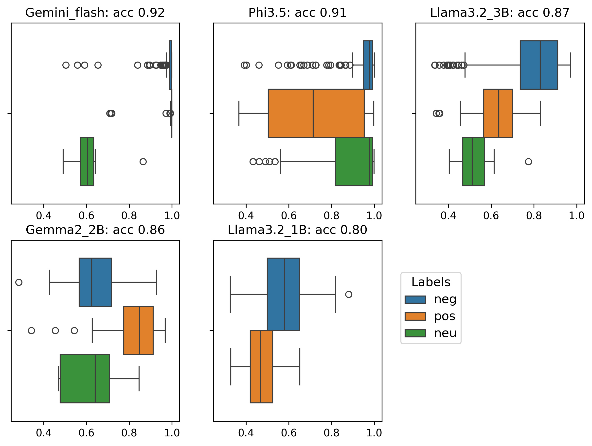

# Predicting directions of outcome measures
Here a summary of the progress, that I will update regularly. 

I tested a suite of LLMs to see whether they approximate GPT-4's accuracy but faster and cheaper for our large dataset. Tested LLMs: **llama3-8b-8192, llama3-70b-8192, llama-3.1-70b-versatile, mixtral-8x7b-32768, gemma-7b-it, gemini-1.5-flash-002, gemini-1.5-pro-002 ,microsoft-phi.3.5,gemma2-2b, llama3.2-3b, llama3.2-1b**. 

Accuracies are always w.r.t. GPT-4 answers for the sample of 250 rows, as these were found to be quite accurate.

## Accuracy
Results on *RCT* level:

| LLM  | Acc  |
|---|---|
|gemini-1.5-flash-002|.92|
|llama3-8b-8192|.92|
microsoft/Phi-3.5-mini-instruct|.91|
|gemini-1.5-pro-002|.91|
|llama-3.1-70b-versatile|.90|
|mixtral-8x7b-32768|.90|
|llama3-70b-8192|.89|
|gemma-7b-it|.88|
|meta-llama/Llama-3.2-3B-Instruct|.87
|google/gemma-2-2b-it|.86|
|meta-llama/Llama-3.2-1B-Instruct|.80|
|Majority-vote-baseline|.67|

Results on *review* level (majority vote on the most frequent effect direction, with 'id' column as review indicator variable):

| LLM  | Acc  |
|---|---|
|gemini-1.5-flash-002|.96|
|llama3-8b-8192|.94|
microsoft/Phi-3.5-mini-instruct|.93|
|gemini-1.5-pro-002|.94|
|llama-3.1-70b-versatile|.94|
|mixtral-8x7b-32768|.94|
|llama3-70b-8192|.94|
|gemma-7b-it|.92|
|meta-llama/Llama-3.2-3B-Instruct|.90
|google/gemma-2-2b-it|.91|
|meta-llama/Llama-3.2-1B-Instruct|.85|
|Majority-vote-baseline|.75|

On the level of *RCTs* llama3-8b-8192 and gemini-1.5-flash-002 (both 92% accurate) are highly competitive. On the level of *reviews* gemini-1.5-flash-002 is the winner (96% accurate). Detailed results visible in LLM_preds_evals.ipynb under 'Evaluation'. Gemini-1.5-flash-002 is competitive: it has a free slow version, but the paid version is blazingly fast and cheap (250 rows in 2 minutes for less than 2 eurocents). A notable mention is for microsoft-phi3.5 as good performing small, open, locally runnable, free, and super-fast model. I think it would be extremely interesting to verify the output of local, small and free models with medical experts, next to the larger best ones like gemini-1.5-flash-002.  

## Confidence
Confidence in the form of output token probabilities at RCT level is only available for gemini-1.5-flash-002, microsoft-phi.3.5, gemma2-2b, llama3.2-3b, llama3.2-1b.

Overall better models are more sure of their predictions. 'Neutral' is the most difficult label and indeed a problematic one in that it has no clear interpretation for either humans nor LLMs (we could consider dropping it). Interestingly, models that do worse are also less confident, although such models could of course make wrong predictions with high confidence. This means that beyond accuracy for a particular task (which is well above the baseline), confidence can give an idea of how fit a model is for a particular task, which does not get much attention in the literature.        

Which specialties are difficult for a selection of models? Pregnancy & childbirth is for all the most difficult, and to a lesser extent psychiatry and mental health. 

**gemini-1.5-flash-002**
| Specialty  | Confidence <.95, 24 rows total  |
|---|---|
| Gynaecology & Urology  | 1  |
| Heart & hypertension    |1   |
| Hepato-Biliary  | 2  |
| Infectious Diseases  | 2  |
| Neonatal  | 1  |
| Neurology  | 1  |
| Pregnancy & Childbirth  | 8  |
| Psychiatry & Mental health  | 8  |

**microsoft/Phi-3.5-mini-instruct**
| Specialty  | Confidence <.7, 38 rows total  |
|---|---|
| Emergency & Trauma  | 2  |
| Gynaecology & Urology    | 7  |
| Infectious Diseases  | 7  |
| Lungs  | 1  |
| Pregnancy & Childbirth  | 20  |
| Psychiatry & Mental health  | 1  |

**gema-2-2b**
| Specialty  | Confidence <.7, 125 rows total  |
|---|---|
| Emergency & Trauma  | 6  |
| Gynaecology & Urology    | 1  |
| Heart & hypertension | 2 |
| Hepo-biliary | 2 |
| Infectious Diseases  | 13  |
| Lungs  | 6  |
| Neonatal | 9 |
| Neurology| 6 |
| Oncology | 1 | 
| Pregnancy & Childbirth  | 70  |
| Psychiatry & Mental health  | 9  |
