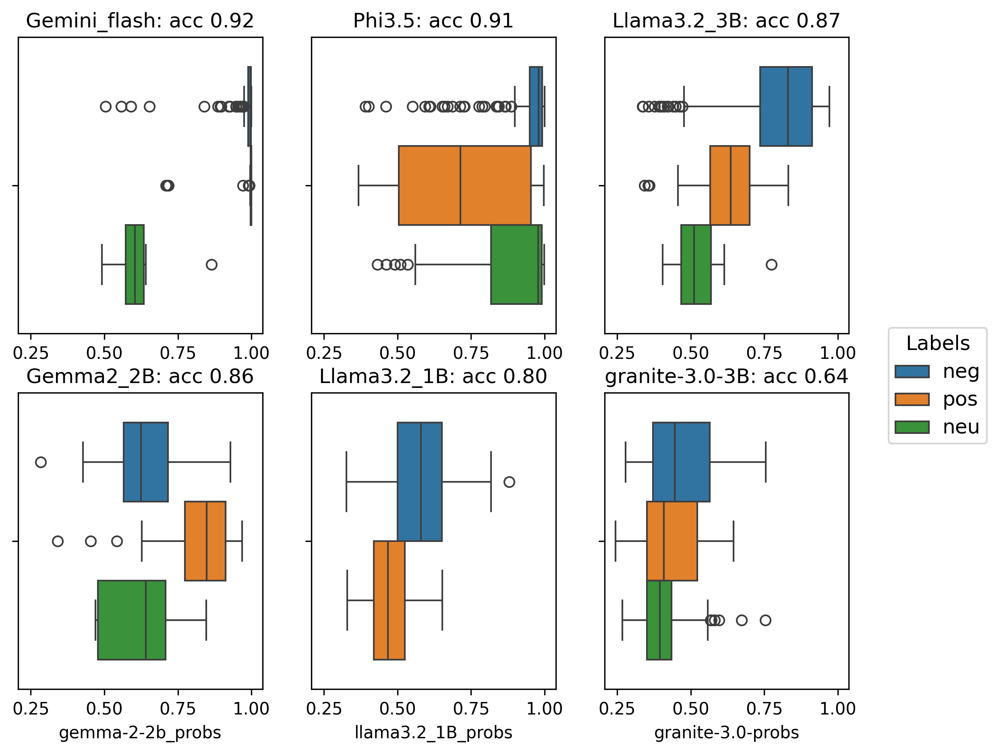

# Predicting directions of outcome measures
Here a summary of the progress, that I will update regularly. 

I tested a suite of LLMs to see whether they approximate GPT-4's accuracy but faster and cheaper for our large dataset. Tested LLMs: **llama3-8b-8192, llama3-70b-8192, llama-3.1-70b-versatile, mixtral-8x7b-32768, gemma-7b-it, gemini-1.5-flash-002, gemini-1.5-pro-002 ,microsoft-phi.3.5,gemma2-2b, llama3.2-3b, llama3.2-1b**. 

Accuracies are always w.r.t. GPT-4 answers for the sample of 250 rows, as these were found to be quite accurate.

## Accuracy
Results on *RCT* level:

| LLM  | Acc  |
|---|---|
|gemini-1.5-flash-002|.92|
|llama3-8b-8192|.92|
microsoft/Phi-3.5-mini-instruct|.91|
|gemini-1.5-pro-002|.91|
|llama-3.1-70b-versatile|.90|
|mixtral-8x7b-32768|.90|
|llama3-70b-8192|.89|
|gemma-7b-it|.88|
|meta-llama/Llama-3.2-3B-Instruct|.87
|google/gemma-2-2b-it|.86|
|meta-llama/Llama-3.2-1B-Instruct|.80|
|Majority-vote-baseline|.67|

Results on *review* level (majority vote on the most frequent effect direction, with 'id' column as review indicator variable):

| LLM  | Acc  |
|---|---|
|gemini-1.5-flash-002|.96|
|llama3-8b-8192|.94|
microsoft/Phi-3.5-mini-instruct|.93|
|gemini-1.5-pro-002|.94|
|llama-3.1-70b-versatile|.94|
|mixtral-8x7b-32768|.94|
|llama3-70b-8192|.94|
|gemma-7b-it|.92|
|meta-llama/Llama-3.2-3B-Instruct|.90
|google/gemma-2-2b-it|.91|
|meta-llama/Llama-3.2-1B-Instruct|.85|
|Majority-vote-baseline|.75|

On the level of *RCTs* llama3-8b-8192 and gemini-1.5-flash-002 (both 92% accurate) are highly competitive. On the level of *reviews* gemini-1.5-flash-002 is the winner (96% accurate). Results can be seen in more detail in LLM_preds_evals.ipynb under 'Evaluation'. Gemini-1.5-flash-002 is competitive: it has a free version (but a slow one with 15 rows per minute as limit), but the paid version is much faster and very cheap (250 rows in 2 minutes for less than 2 eurocents). A notable mention is for microsoft-phi3.5 as good performing small, open, locally runnable, free, and super-fast model.   

## Confidence
Confidence in the form of token probabilities is only available for gemini-1.5-flash-002, microsoft-phi.3.5, gemma2-2b, llama3.2-3b, llama3.2-1b.

The model is only unsure about roughly 10% of rows (with probabilities below .95), which is to be expected given its good performance. When looking at these rows we see that the specialties 'pregnancy & childbirth' and 'psychiatry & mental health' are overrepresented. When looking at overrepresented outcome measures and outcomes (visible in LLM_preds_evals.ipynb), we see no measures or outcomes overrepresented in particular (or at least not ones that I as lay person can easily group).

